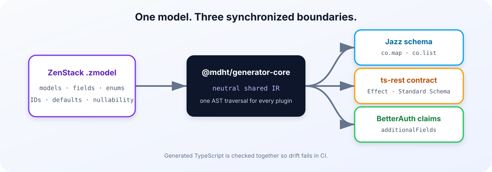

# Prisma Schema Codegen Bridge

[](https://github.com/standard-librarian/prisma-schema-codegen-bridge/actions/workflows/ci.yml)
[](./LICENSE)

Generate a Jazz schema, a ts-rest contract, and BetterAuth claims from one
ZenStack `.zmodel` file. The shared intermediate representation keeps field
names, enum values, nullability, IDs, and defaults aligned across every output.



## Packages

| Package | Use it for |
|---|---|
| [`@mdht/plugin-jazz-schema`](https://www.npmjs.com/package/@mdht/plugin-jazz-schema) | Jazz `co.map` / `co.list` schemas |
| [`@mdht/plugin-ts-rest-contract`](https://www.npmjs.com/package/@mdht/plugin-ts-rest-contract) | ts-rest CRUD contracts validated by Effect Schema |
| [`@mdht/plugin-betterauth-claims`](https://www.npmjs.com/package/@mdht/plugin-betterauth-claims) | BetterAuth `additionalFields` from auth-model enums |
| [`schema-codegen-bridge`](https://www.npmjs.com/package/schema-codegen-bridge) | A safer `zen generate` wrapper for the complete suite |
| [`@mdht/generator-core`](https://www.npmjs.com/package/@mdht/generator-core) | Shared ZModel AST → neutral IR for plugin authors |

## Quick start

Install the CLI and the generators you need:

```bash
npm install --save-dev @zenstackhq/cli schema-codegen-bridge \
  @mdht/plugin-jazz-schema \
  @mdht/plugin-ts-rest-contract \
  @mdht/plugin-betterauth-claims

npm install jazz-tools effect @ts-rest/core@3.53.0-rc.1 \
  better-auth @better-auth/core
```

The second command installs the runtime libraries imported by the generated
files. Omit a runtime when you are not using its generator.

Add the plugin blocks to `zenstack/schema.zmodel`:

```zmodel
plugin jazz {
    provider = '@mdht/plugin-jazz-schema'
    output = '../generated/jazz-schema.ts'
}

plugin tsRestContract {
    provider = '@mdht/plugin-ts-rest-contract'
    output = '../generated/ts-rest-contract.ts'
}

plugin betterauthClaims {
    provider = '@mdht/plugin-betterauth-claims'
    output = '../generated/betterauth-claims.ts'
}
```

Mark the relevant models:

```zmodel
enum Role {
    MEMBER
    ADMIN
}

model User {
    id   String @id @default(cuid())
    role Role

    @@auth
}

model Project {
    id          String  @id @default(cuid())
    name        String
    description String?

    @@tsRestContract
}
```

Generate all outputs:

```bash
npx schema-codegen-bridge generate
```

The CLI follows ZenStack's schema discovery order: `zenstack.schema` in
`package.json`, `schema.zmodel`, then `zenstack/schema.zmodel`. Use
`--schema <path>` to override it. Extra ZenStack flags can follow `--`.

## Use the generated files

```ts
import { Project } from './generated/jazz-schema.js';
import { contract } from './generated/ts-rest-contract.js';
import { additionalFields } from './generated/betterauth-claims.js';
import { betterAuth } from 'better-auth';

export const auth = betterAuth({
  user: { additionalFields },
});

export { Project, contract };
```

## What is kept in sync

- Enums become literal tuples in all relevant artifacts.
- ZModel nullable fields accept `null`; create and patch inputs model omission
  separately.
- Required natural and compound IDs remain required on create.
- Compound IDs produce one URL segment per ID field.
- Defaulted fields are optional on create, while ID fields are protected on
  update.
- Jazz relations use getter form so circular and forward references work.

The [POS inventory example](./examples/pos-inventory-demo) generates all three
artifacts, typechecks them against the real libraries, and runs cross-artifact
runtime assertions.

## Compatibility and limits

- Node.js 22.6 or newer.
- ZenStack 3.9.x.
- `@ts-rest/core@3.53.0-rc.1` is required because the current stable release
  does not yet accept Standard Schema validators.
- Relation fields are intentionally omitted from REST request/response schemas;
  scalar foreign keys remain.
- `BigInt`, `Decimal`, and `Bytes` currently use documented lossy fallbacks.
- BetterAuth generation currently supports enum fields on a model-based
  `@@auth` target.
- ZenStack access policies are not translated into Jazz permission groups.

See the [changelog](./CHANGELOG.md) and the deeper
[plugin API notes](./docs/plugin-api-notes.md) for release history and design
constraints. Maintainers can use the [release checklist](./docs/releasing.md)
to publish the workspace in dependency order.

## Development

```bash
pnpm install
pnpm run verify
pnpm run pack:dry-run
```

`verify` typechecks package source, regenerates the example, typechecks generated
code, runs cross-artifact assertions, and exercises CLI schema discovery and
argument handling.

## License

[MIT](./LICENSE)
